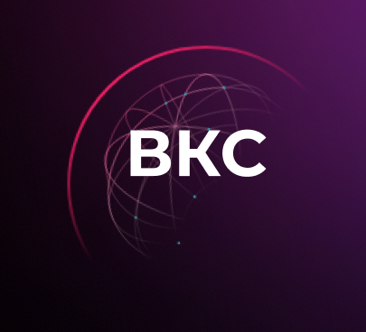
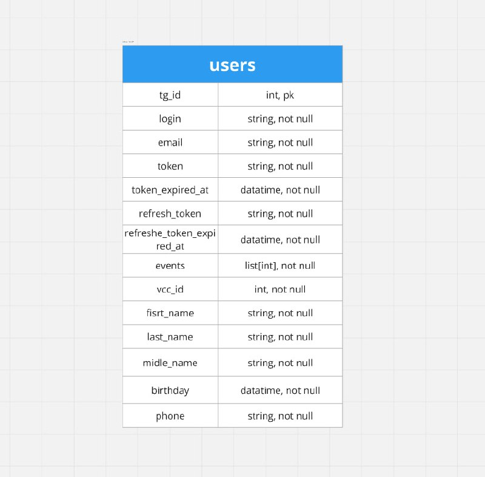
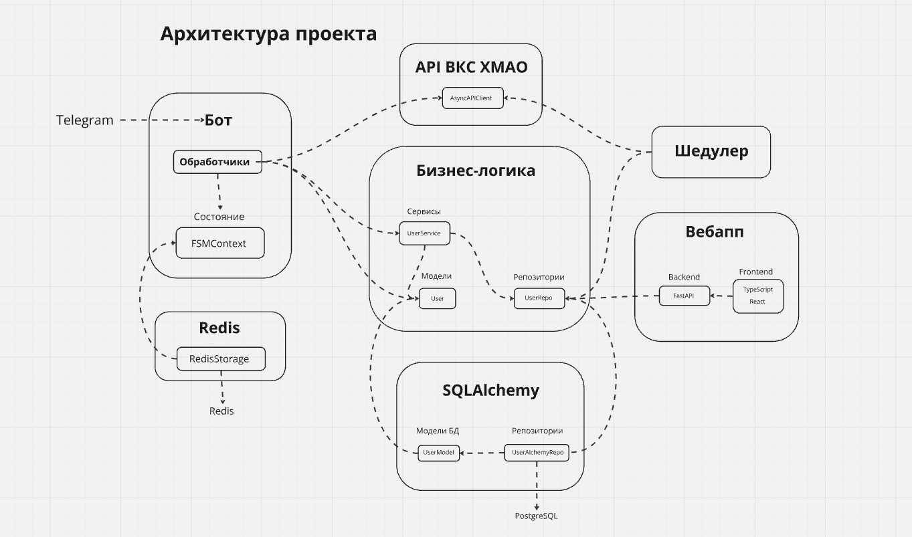

# Hackathon-SSD-2024
<p align="center">
  
</p>
<div align="center">

  


</div>


## Запуск
1. Склонируйте репозиторий и перейдите в него
   ```bash
   git clone https://github.com/coder-smookki/Hackathon-SSD-2024.git
   cd ./Hackathon-SSD-2024
   ```

2. Создать и заполнить файл .env в корневой папке
   ```
    BOT_TOKEN=<token>

    DB_HOST=<str>
    DB_PORT=<int>
    DB_NAME=<str>
    DB_USER=<str>
    DB_PASSWORD=<str>
    ```

## Установка зависимостей
   Установка всех библиотек перечисленный в `requirements.txt` файле
   ```
    pip install -r ./requirements.txt
   ```

## Docker
1. Необходимо скачать [Docker Engine](https://docs.docker.com/engine/)
2. Сделать сборку и запуск: 
   ``` 
   docker-compose up -d --build
   ```
3. После запуска начать миграцию базы данных
   ```
   docker-compose exec bot alembic revision --autogenerate

   docker-compose exec bot alembic upgrade head
   ```

### docker-compose.yml
Для работы проекта было выделино 5 контейнеров:

1. **Бот (bot)**

   Сам бот, в котором и происходит общение с телегой и управление всем-всем.

2. **Backend для Webapp**

   Был создан для взаимодействия frontend веб приложение с базой данных.

3. **Frontend**

   Создание веб интерфейса, webapp, со всем функционалом бота.

4. **СУБД PostgreSQL (database)**

   Постгресу было отдано предпочтение вместо sqlite'а, так как с ним удобнее взаимодействовать в ручном режиме, когда идёт разработка.

5. **Scheduler**

   Шедулер уведомляет пользователей о ближайших ВКС.

## Реализованные пункты
   - #### Авторизация пользователя ВКС 
     При запуске бота не авторизированному пользователью требуется произвести вход в аккаунт. Бот запрашивает email, пароль. Данные сохраняются
     в базе данных
   
   - #### Просмотр профиля
     Перейдя в раздел "профиль", пользователь получает все данные о его профиле 

   - #### Создание встреч ВКС
     Юзер с лёгкостью может создать ВКС в любой удобное для него время, также может указать определенное количества участников встречи

   - #### Просмотр всех ВКС
     Юзер имеет доступ к просмотру всех ВКС, в том числе, которые уже закончились и запланированные, а также по определённым фильтрам

   - #### Просмотр участников ВКС
     У авторизированного япользователя есть возможность проссматривать всех участников определённой встречи

   - #### WebApp - вэб версия бота 
     У пользователя при использовании WebApp будет весь функционал бота: создание встреч, просмотр профиля, участников и всех ВКС
   

## Внешние интеграции, обоснование выбора

   ### **[PostgreSQL](https://en.wikipedia.org/wiki/PostgreSQL)**
**Обоснование выбора:**  
PostgreSQL — это мощная объектно-реляционная СУБД с открытым исходным кодом. Она была выбрана благодаря следующим преимуществам:  
- **Надежность и масштабируемость:** PostgreSQL поддерживает большие объемы данных и сложные запросы, что делает ее отличным выбором для высоконагруженных систем.  
- **Расширяемость:** Поддержка пользовательских функций и типов данных.  
- **Соответствие стандартам SQL:** Полная поддержка ACID, транзакций и сложных операций с данными.  
- **Широкая экосистема:** Хорошая интеграция с различными языками и фреймворками, включая SQLAlchemy для Python.

---

### **[Redis]((https://en.wikipedia.org/wiki/Redis))**
**Обоснование выбора:**  
Redis — это высокопроизводительное хранилище данных в оперативной памяти, используемое как кэш, брокер сообщений или база данных.  
- **Быстродействие:** Redis хранит данные в оперативной памяти, что обеспечивает минимальную задержку и максимальную скорость чтения/записи.  
- **Поддержка сложных структур данных:** Помимо ключ-значения, Redis поддерживает списки, множества и хэши.  
- **Широкие сценарии использования:** Подходит для кэширования, управления сессиями и очередей задач.  
- **Простота интеграции:** Легко интегрируется с FastAPI через сторонние библиотеки, такие как `aioredis`.

---

### **[FastAPI](https://en.wikipedia.org/wiki/FastAPI)**
**Обоснование выбора:**  
FastAPI — современный, асинхронный веб-фреймворк для создания API на Python. Он был выбран по следующим причинам:  
- **Высокая производительность:** Благодаря использованию асинхронных возможностей Python и асинхронного веб-сервера Uvicorn, FastAPI обеспечивает быструю обработку запросов.  
- **Интуитивно понятный синтаксис:** Простота в использовании, поддержка аннотаций типов для автоматической генерации документации (OpenAPI/Swagger).  
- **Встроенная поддержка валидации данных:** Использование Pydantic для автоматической проверки входных данных.  
- **Сообщество:** Активное развитие и поддержка большого сообщества разработчиков.

---

### **[Aiogram](https://docs.aiogram.dev/en/v3.15.0/)**
**Обоснование выбора:**  
Aiogram — асинхронная библиотека для разработки Telegram-ботов на Python.  
- **Асинхронность:** Позволяет эффективно обрабатывать множество запросов одновременно, что повышает производительность.  
- **Гибкость:** Предоставляет удобные инструменты для маршрутизации сообщений и взаимодействия с Telegram API.  
- **Модульность:** Aiogram позволяет использовать middleware для расширения функциональности бота.  
- **Поддержка вебхуков:** Aiogram легко интегрируется с FastAPI для работы через вебхуки, что повышает надежность взаимодействия.

---

### **[SQLAlchemy](https://en.wikipedia.org/wiki/SQLAlchemy)**
**Обоснование выбора:**  
SQLAlchemy — это один из наиболее популярных ORM (Object-Relational Mapping) инструментов для Python.  
- **Универсальность:** Поддержка различных СУБД, включая PostgreSQL.  
- **Гибкость:** Возможность работы как с ORM, так и с чистым SQL через Core API.  
- **Транзакционная безопасность:** Поддержка транзакций и сложных операций с базами данных.  
- **Интеграция с FastAPI:** Позволяет легко управлять сессиями и выполнять асинхронные запросы к базе данных через `asyncpg` или `databases`.

---

### [Описание API](https://openweathermap.org/)

**Данная api** была предоставлена для получения данных по ВКС, пользователя и тд, а также для создания ВКС.

**Использование**

Для удобства использования api была помещена в обертку-класс, [AsyncAPIClient](https://github.com/coder-smookki/Hackathon-SSD-2024/tree/main/bot/core/api/api_vks.py)

**API для взаимодействия с ВКС**

- Авторизация, получение токен пользователя
```python
await AsyncAPIClient().auth_login(login, password)
```

- Выход из аккаунта
```python
await AsyncAPIClient().auth_logout(token)
```

- Обновление токена пользователя
```python
await AsyncAPIClient().update_token(refresh_token)
```

- Создание ВКС
```python
await AsyncAPIClient(jwt_token,
    organizer_id,
    name_vks,
    date_vks, 
    duration_vks,
    participants_count_vks, 
    participants,
    backend,
    settings,
    place
    ).create_meeting(refresh_token)
```

- Получение всех мест проведения ВКС
```python
await AsyncAPIClient(jwt_token).get_buildings(jwt_token)
```

- Получение всех комнат в этом месте
```python
await AsyncAPIClient(jwt_token).get_rooms(jwt_token)
```

- Получение пользователя по почте
```python
await AsyncAPIClient(jwt_token).get_user(jwt_token, email)
```

- Получение пользователя по почте
```python
await AsyncAPIClient(jwt_token).get_user(jwt_token, email)
```

- Получение всех ВКС по фильтрам
```python
await AsyncAPIClient(jwt_token).get_meetings(
    jwt_token,
    page,
    date_from, 
    date_to,
    state,
    filters
    )
```

## Схема данных СУБД
**PostgreSQL**




## Чистота кода
В проекте используются ruff, black и isort - линтеры, приводящие код к одному стилю.
Также установлен pre-commit, чтобы не забыть использовать всё перед отправкой на гитхаб.

### Визуализация архитектуры 
